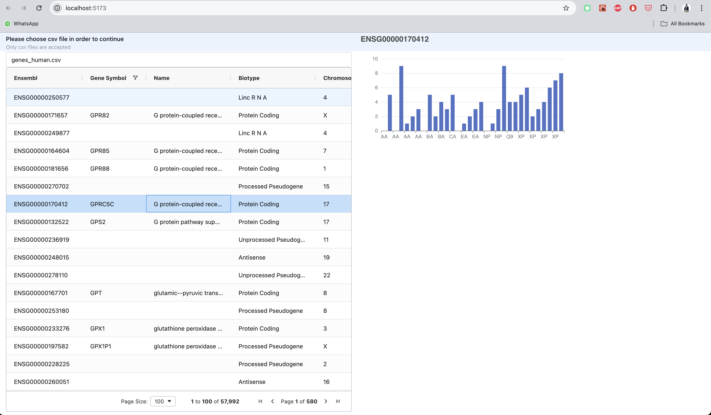
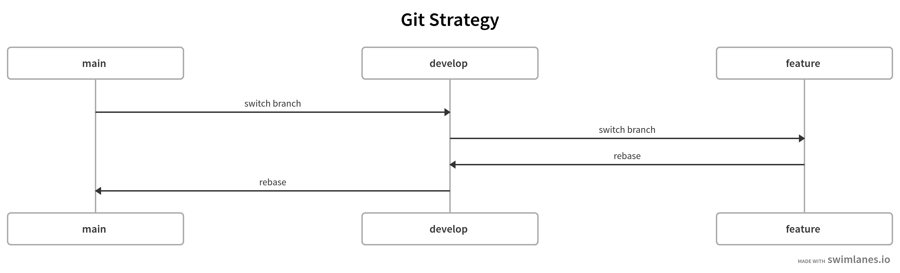
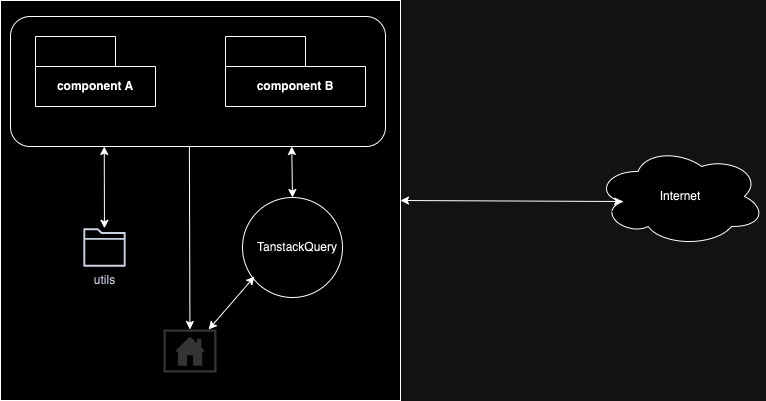

<!-- TABLE OF CONTENTS -->
<details>
  <summary>Table of Contents</summary>
  <ol>
    <li>
      <a href="#about-the-project">About The Project</a>
      <ul>
        <li><a href="#built-with">Built With</a></li>
      </ul>
    </li>
    <li>
      <a href="#getting-started">Getting Started</a>
      <ul>
        <li><a href="#prerequisites">Prerequisites</a></li>
        <li><a href="#installation">Installation</a></li>
      </ul>
    </li>
    <li><a href="#usage">Usage</a></li>
    <li><a href="#folder-structure">Folder Structure</a></li>
    <li><a href="#git-strategy">Git Strategy</a></li>
    <li><a href="#architecture">Architecture</a></li>
    <li><a href="#dev-links">Dev Links</a></li>
    <li><a href="#live-demo">Live Demo</a></li>
  </ol>
</details>


<!-- ABOUT THE PROJECT -->
## About The Project


This project reads `CSV` file to get human genes data and render it in a table. Upon clicking on a particular row, it makes a request to server using `tanstack query` to get detail protein data to render the details on a chart using `echarts` library.


### Built With

Below are the core technologies I used for this project.

* [React](https://reactjs.org/)
* [Mantine](https://mantine.dev/)
* [Visual Studio Code](https://code.visualstudio.com/)
* [ECharts](https://echarts.apache.org/en/index.html)
* [ECharts For React](https://www.npmjs.com/package/echarts-for-react)
* [Tanstack Query(formerly React Query)](https://tanstack.com/)
* [Ag Grid](https://www.ag-grid.com/)
* [Ag Grid React](https://www.npmjs.com/package/ag-grid-react)
* [Axios](https://axios-http.com/)
* [Papaparse](https://www.papaparse.com/)
* [Conventional Commit](https://www.conventionalcommits.org/en/v1.0.0/)
* [Vite](https://vitejs.dev/)
* [Axios](https://axios-http.com/)
* [Github](https://github.com/)
* [eslint](https://eslint.org/)
* [prettier](https://prettier.io/)
* [husky](https://typicode.github.io/husky/)
* [youtube](https://youtube.com)
* [Swimlanes](https://swimlanes.io)
* [Draw IO](https://draw.io/)


<!-- GETTING STARTED -->
## Getting Started

To run this project, please follow the steps below.

### Prerequisites

To install node v21.1.0, run the command below.

* node
  ```sh
  nvm install v21.1.0
  ```

To install yarn run the command below.
* yarn
  ```sh
  npm install --global yarn
  ```

### Installation

1. Clone the repo
   ```sh
   git@github.com:zafar-saleem/human-genes.git
   ```
2. Install NPM packages
   ```sh
   yarn
   ```

<!-- USAGE EXAMPLES -->
## Usage

To run the project, below command will help.

  ```sh
  yarn dev
  ```


<!-- FOLDER STRUCTURE -->
## Folder Structure

  ```bash
  .
├── README.md
├── commitlint.config.cjs
├── dist
│   ├── assets
│   │   ├── index-Dbn_WRaw.css
│   │   └── index-GmMvk0Mz.js
│   ├── index.html
│   └── vite.svg
├── eslint.config.js
├── index.html
├── package.json
├── public
│   └── vite.svg
├── src
│   ├── App.css
│   ├── App.jsx
│   ├── assets
│   │   └── react.svg
│   ├── components
│   │   ├── CSVSelector
│   │   │   ├── csv-selector.jsx
│   │   │   └── index.jsx
│   │   └── CSVreader
│   │       ├── csv-reader.jsx
│   │       └── index.jsx
│   ├── index.css
│   ├── main.jsx
│   └── utils
│       └── utils.js
├── vite.config.js
└── yarn.lock
  ```

<!-- GIT STRATEGY -->
## Git Strategy

The git strategy I used for this project below. The complete workflow is depicted in below screenshot.



<!-- ARCHITECTURE -->
## Architecture

Below is an Architecture I followed for this project.



<!-- DEV LINKS -->
## Dev Links

* [Gitlab Project](https://github.com/zafar-saleem/human-genes)
* [Commits](https://github.com/zafar-saleem/human-genes/commits/develop/)

<!-- LIVE DEMO -->
## Live Demo

Click on below screenshot to view live demo on youtube.

[](https://youtu.be/HNWBTaeCZcI)
